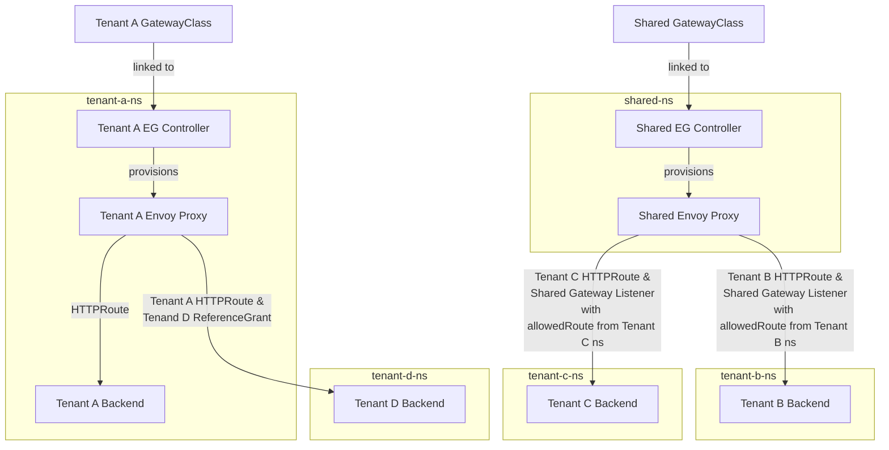

# Gateway API Multitenancy Testing with Envoy Gateway

## Testing Environment



## Running the Example in a Kind Cluster

Spin up a kind cluster:

```bash
make cluster-up
```

The Envoy Gateway project recommends a [multi-tenancy model](https://gateway.envoyproxy.io/v0.5.0/user/deployment-mode.html) whereby each tenant deploys their own Envoy Gateway controller in a namespace which they own. We will also explore the implications and risks associated with multiple tenants using a shared controller. As such, we will create two Envoy Gateway controllers - one dedicated controller for Tenant A, and one shared controller for Tenants B and C. To create these controllers, run the following (using Envoy Gateway v0.5.0):

```bash
make tenant-a-controller-install
make shared-controller-install
```

Each Envoy Gateway controller can accept a single GatewayClass resource, so let's create a Tenant A and a shared GatewayClass:

```bash
make gwc-tenant-a
make gwc-shared
```

Create the shared Gateway in the `shared` namespace:

```bash
make shared-gw-create
```

Note that the shared Gateway defines a listener which allows routes from the `tenant-b` and `tenant-c` namespaces to attach to it, as per our example architecture:

```yaml
apiVersion: gateway.networking.k8s.io/v1beta1
kind: Gateway
metadata:
  name: eg
  namespace: shared
spec:
  gatewayClassName: eg-shared
  listeners:
    - name: http
      protocol: HTTP
      port: 8080
      allowedRoutes:  
        namespaces:
          from: Selector
          selector:
            matchExpressions:
            - key: kubernetes.io/metadata.name
              operator: In
              values:
              - tenant-b
              - tenant-c
```

Create backend services and deployments for Tenants A, B, C and D, noting that we will also create a dedicated Gateway for Tenant A:

```bash
make run-backend-services
```

Note the creation of `HTTPRoute`s in each of Tenant A, B and C's namespaces. For Tenant A, the `parentRef` is its own Gateway:

```yaml
apiVersion: gateway.networking.k8s.io/v1beta1
kind: HTTPRoute
metadata:
  name: backend
  namespace: tenant-a
spec:
  parentRefs:
    - name: eg
  hostnames:
    - "www.tenant-a.example.com"
  rules:
    - backendRefs:
        - group: ""
          kind: Service
          name: backend
          port: 3000
          weight: 1
      matches:
        - path:
            type: PathPrefix
            value: /
```

For Tenants B and C, the `parentRef` refers to the shared Gateway:

```yaml
apiVersion: gateway.networking.k8s.io/v1beta1
kind: HTTPRoute
metadata:
  name: backend
  namespace: tenant-b
spec:
  parentRefs:
    - name: eg
      namespace: shared
  hostnames:
    - "www.tenant-b.example.com"
  rules:
    - backendRefs:
        - group: ""
          kind: Service
          name: backend
          port: 3000
          weight: 1
      matches:
        - path:
            type: PathPrefix
            value: /
```

For now, we have not set up a route to Tenant D's backend.

### Access Tenant A's Service

Set up port fowarding to the Tenant A Gateway:

```bash
make port-forward-tenant-a
```

Curl the service:

```bash
make curl-tenant-a
```

### Access Tenant B and C Services

Set up port fowarding to the Shared Gateway:

```bash
make port-forward-shared-tenants
```

Curl the Tenant B service:

```bash
make curl-tenant-b
```

Curl the Tenant C service:

```bash
make curl-tenant-c
```

### Exploring ReferenceGrants with Tenant D

So far, we have not set up a route to Tenant D's backend Service. Note that until now, all `HTTPRoute`s have been created in the same namespaces as the backend which they route to.

Imagine someone with the permission to create `HTTPRoute`s in the `tenant-a` namespace (as in [cross-ns-route.yaml](./manifests/cross-ns-route.yaml)) tries to create a route to Tenant D's backend service:

```bash
make cross-ns-route-create
```

If we try to access Tenant D's Service via Tenant A's Gateway, we will see an error:

```bash
make curl-tenant-d
```

In accordance with Gateway API [security principles](https://gateway-api.sigs.k8s.io/concepts/security-model/), for such a cross-namespace connection to succeed, a handshake has to occur between namespaces. In this case, as the `HTTPRoute` was created in the `tenant-a` namespace, a [ReferenceGrant](https://gateway-api.sigs.k8s.io/api-types/referencegrant/) would need to exist in the `tenant-d` namespace. Let's demonstrate this:

```bash
make ref-grant-create
```

Try accessing the Tenant D Service again, and observe that it now works:

```bash
make curl-tenant-d
```

## Teardown

```bash
make teardown
```
